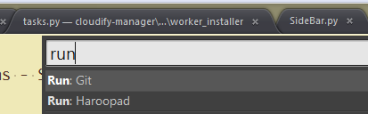

# Run applications - Sublime Text

Run any customized application from command palette. Just Ctrl/Command+Shift+P, input `Run: XXX`, that's it!



## Installation Instructions

**Package Installer**

* Install [Sublime Package Control](http://wbond.net/sublime_packages/package_control)
* Select "Package Control: Install Package" from the Command Palette (`super/ctrl+shift+p`)
* Find "Run Apps" and select

**Git clone**
* Enter directory through "Browse Packages..." in Sublime Text "Preferences"
* Run
    ```
    git clone https://github.com/liuhewei/run-app-sublime.git
    ```

## Usage
Firstly, add applications through: "Tools" -> "Run Apps" -> "Add Application".

Each application follows:
```
    {
        "caption": "Run: Git",  // Run: <App-name>, shown in command pallete
        "command": "runapp",    // cannot be changed
        "args":{
          // application full path on Win/Linux, or only name on MAC
          "app": "",

          // argument list
          // variables can be use: $DIR$, $FILE$, $PROJ$
          "args": [""],

          // define what should follow the command:
          // "dir" - file directory, same as $DIR$
          // "file" - file name, same as $FILE$
          // "proj" - project directory, same as $PROJ$
          // "none" - nothing: if args use variables, "type" must be "none"
          "type": ""
        }
    }
```

Take "Git bash on windows" as an example, the original command is:

`C:/Windows/system32/wscript "D:/Tools/Git/Git Bash.vbs" <directory>`

```json
    {
        "caption": "Run: Git",
        "command": "runapp",
        "args":{
          "app": "C:\\Windows\\system32\\wscript",
          "args": ["D:\\Tools\\Git\\Git Bash.vbs"],
          "type": "proj"
        }
    }
```


